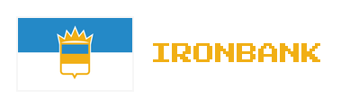

<p align="center">
  
</p>

<p align="center">
  <strong>A Modern Shop & Trade Tracker for CivMC</strong>
</p>

<p align="center">
  <a href="#features">Features</a> •
  <a href="#installation">Installation</a> •
  <a href="#getting-started">Getting Started</a> •
  <a href="#pages">Pages</a> •
  <a href="#development">Development</a>
</p>

---

## About

**Ironbank** is a desktop application for tracking shops, trades, and economic data on [CivMC](https://civwiki.org/wiki/CivMC), a geopolitical Minecraft server. Built with [Tauri](https://tauri.app/) and React, it provides a native, lightweight experience for managing shop ledgers with full offline support.

Originally developed for the [Commonwealth](https://civwiki.org/wiki/The_Commonwealth_(CivMC)), Ironbank helps players:
- **Track shops** — Record shop names, locations, owners, and descriptions
- **Manage trades** — Document buy/sell offers with custom item support
- **Organize players** — Track player IGNs and organize them into groups
- **Visualize on a map** — See all your tracked shops on the CivMC world map
- **Analyze trends** — View statistics about your tracked economy

## Features

### Portable Ledger System
- Each ledger is a standalone `.json` file
- Share ledgers between computers or with other players
- Create multiple ledgers for different regions or purposes
- Automatic backup and versioning

### Smart Search
- Global search across all shops, items, trades, and players
- Real-time filtering and results
- Keyboard shortcuts for quick access

### Full Map Integration
Feature parity with [map.civinfo.net](https://map.civinfo.net):
- **All CivMC rail lines** — HITS, GOR, OneDest, Butternut, and more
- **Rail stations** — All major rail network stations
- **Nether portals** — Portal locations throughout the map
- **Political settlements** — Town and nation markers
- **Multiple tile layers** — Switch between terrain, political, and transportation views
- **Custom markers** — Add your own points of interest

### Designed for YOU!
- Custom frameless window with native controls
- Smooth animations and transitions
- Responsive design that scales from 1024px to 4K
- Built-in tutorial system

## Installation

### Pre-built Releases
Download the latest release for your platform from the [Releases](https://github.com/commonwealth/ironbank/releases) page:
- **Windows**: `Ironbank_x.x.x_x64-setup.exe`
- **macOS**: `Ironbank_x.x.x_universal.dmg`
- **Linux**: `ironbank_x.x.x_amd64.deb` / `.AppImage`

### Building from Source
```bash
# Clone the repository
git clone https://github.com/commonwealth/ironbank.git
cd ironbank

# Install dependencies
npm install

# Run in development mode
npm run tauri:dev

# Build for production
npm run tauri:build
```

**Requirements:**
- Node.js 18+
- Rust 1.70+
- Platform-specific build tools (see [Tauri Prerequisites](https://tauri.app/v1/guides/getting-started/prerequisites))

## Getting Started

### Interactive Tutorial
Ironbank includes a comprehensive 25+ step guided tutorial that walks you through every feature:

1. **Launch Ironbank** — The home page shows your ledger files
2. **Click the Tutorial Ledger** — Pre-populated with example data
3. **Follow the spotlight** — Apple-style highlights guide you through the interface
4. **Explore each page** — The tutorial visits all 5 main sections
5. **Create your first shop** — Practice the full creation workflow

The tutorial can be exited at any time by pressing `Esc` or clicking the 'X' button in the corner of the window controls. The tutorial ledger automatically resets for your next session.

### Quick Start
1. Click **New Ledger** on the home page
2. Name your ledger (e.g., "My Shop Network")
3. Click the **+** button to add your first shop
4. Fill in shop details, location, and trades
5. Save your ledger with **Ctrl+S** or the save button

## Pages

Ironbank is organized into 5 main pages, accessible via the bottom navigation bar:

### 🏪 Shops
The main dashboard for managing your tracked shops.

- **Shop cards** — Overview of each shop with name, owner, and trades
- **Quick actions** — Click any shop card to view details or edit

### 📦 Items
Browse all Minecraft items organized by category.

- **Item search** — Find any item by name
- **Trade statistics** — See which shops buy/sell each item

### 🗺️ Map
Interactive CivMC world map with your shop locations.

- **Shop markers** — All tracked shops appear as markers
- **Click to view** — Click any marker to see shop details
- **Rail overlay** — Toggle rail lines and stations
- **Portal overlay** — Toggle nether portal locations
- **Custom markers** — Add personal waypoints and notes
- **Pan & zoom** — Full navigation with scroll and drag

### 📊 Stats
Analytics and insights about your ledger data.

- **Overview cards** — Total shops, trades, items, and players
- **Top items** — Most traded items in your ledger
- **Trade breakdown** — Buy vs sell offer distribution
- **Recent activity** — Latest additions and modifications
- **Owner statistics** — Shops per player/group

### 👥 Players
Manage player identities and group ownership.

- **Player list** — All tracked player IGNs
- **Player heads** — Minecraft avatar display via Crafatar
- **Notes** — Add notes, extra info, etc.
- **Groups** — Organize players into groups (companies, nations)
- **Group ownership** — Assign shops to groups instead of individuals

## Data Format

Ledgers are stored as JSON files in your Documents folder:
```
Documents/
└── Ironbank/
    └── ledgers/
        ├── my_shops.ledger.json
        ├── commonwealth.ledger.json
        └── tutorial.ledger.json
```

### Ledger Structure
```json
{
  "name": "My Ledger",
  "shops": [...],
  "players": [...],
  "groups": [...],
  "customItems": [...]
}
```

## Keyboard Shortcuts

| Shortcut | Action |
|----------|--------|
| `Ctrl+S` | Save ledger |
| `Ctrl+F` | Focus search |
| `Esc` | Close modal / Exit tutorial |
| `Ctrl+Z` | Undo changes |

## Development

### Tech Stack
- **Frontend**: React 18, TypeScript, Tailwind CSS
- **Backend**: Tauri 2.0 (Rust)
- **State**: Zustand
- **Routing**: React Router
- **Map**: Leaflet + React-Leaflet
- **Icons**: Lucide React

### Project Structure
```
ironbank/
├── src/                    # React frontend
│   ├── components/         # UI components
│   ├── store/              # Zustand stores
│   ├── lib/                # Utilities & Tauri bindings
│   └── data/               # Item/enchantment loaders
├── src-tauri/              # Tauri backend (Rust)
│   ├── src/                # Rust source
│   ├── icons/              # App icons
│   └── resources/          # Bundled resources
├── assets/                 # Static assets
│   ├── items.json          # Minecraft item database
│   ├── blocks.json         # Block database
│   └── enchantments.json   # Enchantment database
└── public/                 # Public assets
```

### Scripts
```bash
npm run dev          # Start Vite dev server
npm run build        # Build for production
npm run tauri:dev    # Run Tauri in development
npm run tauri:build  # Build distributable
```

## Contributing

Contributions are welcome! Please:
1. Fork the repository
2. Create a feature branch
3. Make your changes
4. Submit a pull request

## License

GNU AGPL — see [LICENSE](LICENSE) for details.

---

<p align="center">
  Built with ❤️ for the Commonwealth & CivMC
</p>
